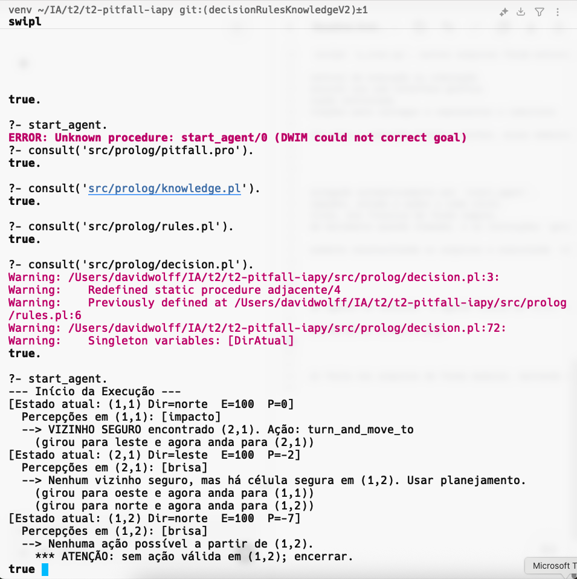

# Pitfall Agente Lógico

Este projeto implementa um agente autônomo baseado em lógica para o ambiente estilo Wumpus/Pitfall, utilizando **Prolog** (SWI-Prolog) e um módulo de planejamento externo em **Python (A\*)**.

## Estrutura do Projeto

```bash
src/
├── prolog/
│   ├── pitfall.pro        # Carregamento do mapa e execução principal
│   ├── knowledge.pl       # Base de conhecimento: fatos dinâmicos
│   ├── rules.pl           # Regras para inferência a partir das percepções
│   └── decision.pl        # Lógica de decisão e fallback com planejamento
├── python/
│   ├── a_star.py          # Planejamento A* sobre células seguras
│   ├── engine.py          # (Opcional) Lógica de execução visual ou de simulação
│   ├── interface.py       # (Opcional) Interface com ambiente visual
│   ├── main.py            # Ponto de entrada de testes (separado)
│   ├── map_loader.py      # Leitura e estruturação de mapas
│   ├── maze.py            # Representação e lógica do labirinto
│   └── mapa_pitfall.txt   # Arquivo de mapa utilizado nos testes
```

## Como executar

1. Abrir o terminal na pasta raiz do projeto
2. Iniciar o SWI-Prolog:
   ```bash
   swipl
   ```
3. Carregar os módulos:
   ```prolog
   consult('src/prolog/pitfall.pro').
   consult('src/prolog/knowledge.pl').
   consult('src/prolog/rules.pl').
   consult('src/prolog/decision.pl').
   ```
4. Iniciar o agente:
   ```prolog
   start_agent.
   ```


---

# Relatório de Desenvolvimento

## Maiores Dificuldades Encontradas

- **Integração entre Prolog e Python:**
  Realizar chamadas ao script A* via `shell/1` e interpretar corretamente as saídas.

- **Ciclo de execução do agente:**
  Organizar a transição entre percepção, inferência, atualização de conhecimento e decisão de forma reativa e robusta.

- **Interpretação das percepções:**
  Algumas percepções como `brisa` e `impacto` geravam ambiguidade sobre como inferir segurança de vízinhos.

- **Evitar loops:**
  O agente originalmente insistia em tentar planejar para células inalcançáveis. Foi otimizado para encerrar quando não há mais ações válidas.


## Otimizações e Decisões

- **Planejamento com A***:
  A chamada ao A* é feita quando não há vízinhos seguros diretos, mas o conhecimento indica que existe alguma célula segura mais distante.

- **Sistema de percepções e inferência modularizado**:
  Regras de inferência ficam separadas em `rules.pl`, tornando o conhecimento mais reutilizável.

- **Decisão modular e clara:**
  Separado em `decision.pl` com `decide_next_action/3` centralizando a lógica.

- **Fallback para planejamento externo**:
  O uso de Python permite delegar complexidade para fora do Prolog, facilitando manutenção do código.


## Modularização Python

Durante o desenvolvimento, além do script `a_star.py`, outros arquivos foram estruturados para permitir expansão futura:

- `engine.py`: pode conter lógica central de execução ou simulação
- `interface.py`: preparado para possível uso com interface gráfica
- `main.py`: ponto de teste ou execução controlada
- `map_loader.py` e `maze.py`: abstrações para carregar e representar o labirinto

Apesar de nem todos serem necessários para a execução Prolog ↔ Python, esses módulos ajudam na organização, testes e possíveis evoluções do projeto.


## Cenário de Testes Automatizado

- O arquivo `mapa_pitfall.txt` é carregado automaticamente por `start_agent`.
- A execução do agente imprime percepções, estado e ações a cada ciclo.
- Quando o agente está sem alternativas, ele finaliza de forma segura.
- O script Python imprime o plano de movimento quando chamado, e as instruções `goto(X,Y)` são interpretadas pelo agente.

> Testes podem ser repetidos simplesmente reconsultando os arquivos e executando `start_agent.`


## Execução Real do Agente

A imagem abaixo mostra a execução do agente no terminal. O agente inicia em (1,1), detecta percepções, realiza uma ação local e, ao encontrar uma situação sem vizinhos seguros, utiliza o A* para planejar o caminho até (1,2):



---

Qualquer modificação futura pode ser feita nos arquivos de forma modular, mantendo o agente robusto e reativo.
